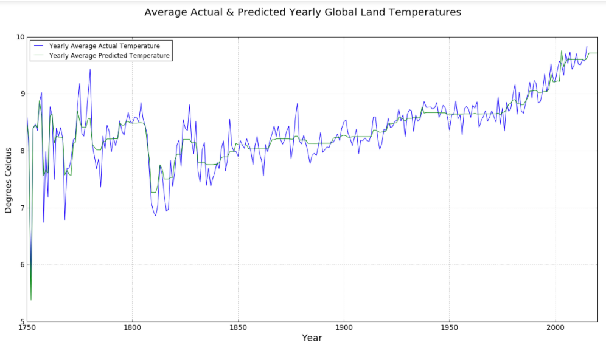

# genetic_algorithm_challenge
Data files, code, and results for Genetic Algorithm Challenge by @Sirajology on Youtube

The Challenge
=============
Use the TPOT library to make a discovery based on a question you pose. The question should be based on the Kaggle Climate Change Dataset (compiled from Berkeley Earth), but you get to choose the question. 

My Approach
============
The Climate Change Dataset on Kaggle contains several data files for land and ocean temperatures both globally and locally. I chose to address the following question:

**What will the monthly global average temperatures be for the next 5 years?**

I chose to use the file, [GlobalTemperatures.csv](GlobalTemperatures.csv), which contains global average land temperatures in celsius for months from 1750-2015. Here is my process:

1. I cleaned the data using the script [clean_data.py](clean_data.py) to produce a .csv file with features that I wanted TPOT to use and no missing data. The main feature I was interested in was the date (dt, in the original data file). I split the date column in to year, month and day. Here, I also renamed the target variable (LandAverageTemperature) as 'class'. The output of clean_data.py is [cleaned_globaldata.csv](cleaned_globaldata.csv).

2. I created a "fake" .csv file containing the years and months for which I wanted to make temperature predictions. This .csv file is called [global_test.csv](global_test.csv). The original data only runs until the year 2015, so in order to predict temperatures for the next 5 years, my test file contains dates for 2016-2020. 

3. I wrote the script [tpot-climate.py](tpot-climate.py) that read in the cleaned temperature data (cleaned_globaldata.csv), and applied the TPOT library to create a machine learning pipeline for predicting temperatures. This script also takes the test file of dates for which the temperature should be predicted (global_test.csv), and outputs the results file [climate_results.csv](climate_results.csv) with these predictions. It also outputs the TPOT optimized pipeline to [climate_pipeline.py](climate_pipeline.py). The file [output.txt](output.txt) is the standard out from running the tpot-climate.py script.

4. I used the outputted, optimized pipeline to see how it would perform when asked to predict monthly global land temperatures on the original data. I did this in [predict_current.py](predict_current.py) to produce [original_data_predictions.csv](original_data_predictions.csv). 

5. With all of the predictions from the optimized pipeline, I created some visualizations to understand TPOT's performance, and the climate data.

Results
==========

The resulting optimized pipeline from TPOT implemented FeatureAgglomeration and GradientBoostingRegressor, scoring 0.6283690079003942 MSE on the cross-validation portion of the training data. 

The original data set (cleaned), shows that the average, yearly, global land temperature has been gradually increasing over time.

Files in this repository
=======================
GlobalTemperatures.csv
clean_data.py
cleaned_globaldata.csv
climate_pipeline.py
climate_results.csv
global_test.csv
original_data_predictions.csv
output.txt
predict_current.py
tpot-climate.py
visualizations.ipynb
